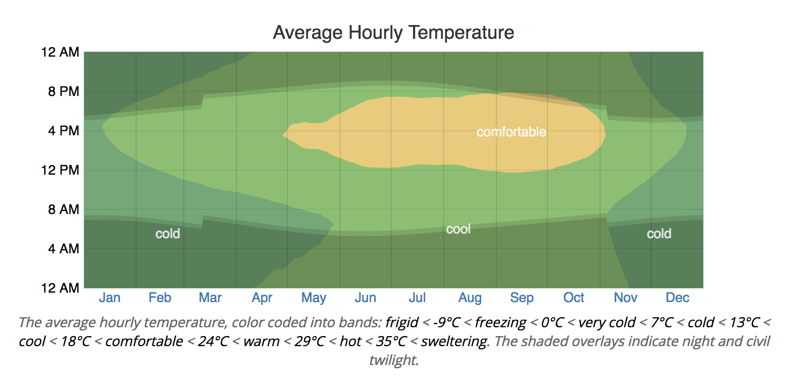

# Project 3: Deliverable I

Project description: https://www.cs.usfca.edu/~mmalensek/courses/cs686/projects/project-3.html

## Three questions from Project 2

### Driest Month in the San Francisco Bay Area

Framework agnostic pseudo code:

    humidity_totals = array<double>[12]
    humidity_counts = array<long>[12]

    for row in dataset:
        m = row.timestamp.month
        humidity_totals[m] += row.relative_humidity_zerodegc_isotherm
        humidity_counts[m]++
        
    for m in January..December:
        avg = humidity_totals[m] / humidity_counts[m]
        print "Average humidity for $m: $avg"
        
In project 2, with Hadoop MapReduce, I fed a key-value pair of <month,humidity> for each observation to the mapper, which then gets <month,list<humidity>> as input and can easily compute the averages.
  
We could do the same with Spark by using the *map* and *reduceByKey* transformations. We could also use *aggregateByKey* and provide an average function as our aggregation method. Or simply sum the values as an aggregation and then use *countByKey* to calculate the average (can be trivially computed on the client). Or calculate that average using the *reduce* action (I think?) by calculating the average of two values, and the average of that, and the average of that, until there are no more values.

Another idea, which I'll explore here, is to use 2 x 12 Accumulators to implement the pseudo code above, thus avoiding any kind of reduce task altogether. The average is then trivially computed on the client. I am hoping that this should be rather fast.
  
The first thing to do is to create those accumulators:

```python
counts = []
totals = []

for i in range(0, 12):
    counts.append(sc.accumulator(0.0)) # accumulator starts with value 0
for i in range(0, 12):
    totals.append(sc.accumulator(0.0))
```

and then we simply iterate over all the data and update them:

```python
import datetime

def timestamp_to_month(ts):
    return datetime.datetime.fromtimestamp(ts / 1e3).month

def update_accumulators(row):
    m = timestamp_to_month(row.Timestamp) - 1
    humidity = row.relative_humidity_zerodegc_isotherm
    totals[m].add(humidity)
    counts[m].add(1)
    
df.foreach(update_accumulators)

averages = []
for i in range(0,12):
    averages.append(totals[i].value / counts[i].value)
```

Simple enough, right? Well... after working for 58 min, Spark stopped and barked at me, because my code contained a bug. The problem is that unlike Java in Python `datetime.month` returns 1-12 but arrays are 0-indexed, also I forgot that `range(1,12)` produces 1, 2, ... 9, 10. The nice thing about this of course being that the program crashes only when processing December data, i.e. the last 8 % of the dataset. Genius!
But that's not the most important lesson here. That would be: test the code on the mini dataset first!
Also, this "query" seems painfully slow. Indeed it took 2.6 hours on my machine (3.1 GHz Core i7, 16 GB RAM). That's weird...

The results:

|Month|Average humidity|
|---|---:|
|January|57.48|
|February|54.57|
|March|52.70|
|April|54.42|
|May|52.10|
|June|51.83|
|July|51.19|
|August|50.36|
|September|50.36|
|October|51.17|
|November|53.84|
|December|55.37|

This looks very incorrect, not at all what I found in project 2.
That's because I forgot to bound my query to the Bay Area. Duh!

Since this was so slow, I ran it using the map and reduce paradigm, and threw a filter in there:

```python
prefixes = ("9q8u", "9q8v", "9q8y", "9q8z", "9q9h", "9q9j", "9q9k", "9q9m", "9q9n", "9q9p")

df.rdd\
    .filter(lambda row: row.Geohash.startswith(prefixes))\
    .map(lambda row: (timestamp_to_month(row.Timestamp), row.relative_humidity_zerodegc_isotherm))\
    .reduceByKey(lambda humidity1, humidity2: (humidity1 + humidity2)/2.0)\
    .collect()
```

and obtained this:

|Month|Average humidity|
|---|---:|
|January  |32.79|
|February |15.00|
|March    |19.08|
|April    |21.90|
|May      |19.36|
|June     |35.50|
|July     |27.29|
|August   |23.12|
|September|28.72|
|October  |36.10|
|November |47.33|
|December |68.04|

Now, that's better. Although the numbers are not the same as in project 2, probably because this comes from a sample, the general trend is the same, and we also find that the driest month of the year is around the end of the winter, though this time in February rather than March.

### A Year of Travel

Reminder:

During my year of travel I would like to visit:

  - dxfy: Halifax, Nova Scotia
  - dk2y: Nassau, Bahamas
  - dpky: Niaga Falls
  - 9whp: Albuquerque
  - 9xhv: Colorado Rockies
  
I had a few criteria such as the temperature and absence of snow.
Also I would like to be visit each destination at least two days in a row.
Here is how I implemented it with Spark:

```python
import numpy as np

def day_of_year(ts):
    return datetime.datetime.fromtimestamp(ts / 1e3).timetuple().tm_yday

# [1, 3, 1, 7, 2, 9, 10] => [[1, 2, 3], [9, 10]]
def consecutive(data):
    data = np.unique(np.array(data))
    # this line from https://stackoverflow.com/a/7353335/753136 :
    arr = np.split(data, np.where(np.diff(data) != 1)[0]+1) 
    return [x.tolist() for x in arr if np.size(x) > 1]

prefixes = (
            "dxfy", # Halifax, Nova Scotia
            "dk2y", # Nassau, Bahamas
            "dpxy", # Niagara Falls
            "9whp", # Albuquerque
            "9xhv"  # Rocky Mountain
           )

df.rdd\
    .filter(lambda row: \
        row.Geohash.startswith(prefixes) and
        row.temperature_surface > 290 and 
        row.temperature_surface < 301 and
        row.snow_depth_surface < 0.01 and
        row.categorical_rain_yes1_no0_surface == 0.0
        )\
    .map(lambda row: (row.Geohash[0:4], day_of_year(row.Timestamp)))\
    .map(lambda tple: (tple[0], [ tple[1] ] ))\
    .reduceByKey(lambda a,b: a + b)\
    .map(lambda tple: (tple[0], consecutive(tple[1])))\
    .filter(lambda tple: len(tple[1]) > 0)\
    .sortByKey()\
    .collect()
```

and this returned the following results:

```
[('9whp', [[202, 203, 204]]),
 ('dk2y', [[7, 8, 9, 10], [46, 47], [322, 323], [343, 344]]),
 ('dpxy', [[241, 242]])]
 ```
 
 in other words:
 
 |Destination|Days|
 |---|---|
 |Albuquerque|July 21-23|
 |Bahamas|January 7-10, February 15-16, November 18-19, December 9-10|
 |Niagara Falls|August 29-30|
 
 As you can see there haven't been two consecutive days in 2015 where Halifax and the Rockies were warm enough for me to go, so I'll just skip those destinations I guess...

### Hottest Temperature

Here I used an SQL to find the maximum temperature, 329 K, at d59eknqv867b, a place about a 2.5 hour drive from Cancun, Mexico, which is also what I found in Project 2.

```python
rows = spark.sql('SELECT Geohash, MAX(temperature_surface) FROM TEMP_DF GROUP BY Geohash').collect()
```

### Overview of my experience

I wrote this section in the form of pros and cons for each framework, **regarding this question only.**

#### Pros of Spark
  
   * Python API has all important features of the native Scala API
   * Can just play around in a single Jupyter notebook, no need to create files, compile them, etc.
   * All the code at the same place
   * Easy to look at intermediary data ("What is my map function generating?")
   * Fancy data sources, can use tables, I could access features by name easily
   * SQL queries
   * Builtin aggregate functions (stddev, mean, ...)
   * Web UI is really cool to see what is going on

#### Cons of Spark

   * Complex API with tons of operations
   * Input / Output of operations not always clear
   * Not clear what approach is best, and faster
   * Painful refactoring necessary if map functions needs to return multiple values
   * Learning curve
   * Operations are inflexible
   * Unpleasant stacktraces
   
#### Pros of MapReduce

   * Straightforward API
   * Almost no Googling required
   * Map and Reduce are actually quite flexible, can return 0, 1, n values
   * Mapper and Reducer can emit another key easily
   
#### Cons of MapReduce

   * Files, compilation, ...
   * Java-only, Python supported only through pipes, so no access to API
   * Requires a main() method (=> Job class)
   * Cannot look at intermediary results
   * Couldn't use my own Writable (Out of Memory errors)
   * Comes with very little, might need boilerplate to do common operations

## Statistics for each feature

```python
for col in sorted(df.columns[2:]):
    try:
        row = spark.sql('SELECT MAX(%s), MIN(%s), AVG(%s), STDDEV(%s) FROM TEMP_DF' % (col, col, col, col)).collect()[0]
        print('Feature:', col)
        print('Max value:', row[0])
        print('Min value:', row[1])
        print('Average:', row[2])
        print('Std. dev.:', row[3])
        print()
    except:
        pass
```

[Aggregate functions](http://spark.apache.org/docs/latest/api/scala/index.html#org.apache.spark.sql.functions$) (here used through SQL) came in handy.

[Here is the report.](/feature_statistics.txt)

## Pearson Correlation Coefficient

To generate the [matrix](/pcc.txt):

```python
import numpy as np
from pyspark.mllib.stat import Statistics
from pyspark.ml.feature import VectorAssembler
from pyspark.mllib.linalg import Vectors

assembler = VectorAssembler(inputCols=df.columns[2:], outputCol="features")
df_features = assembler.transform(df).select('features')

data = df_features.rdd.map(lambda row: Vectors.dense([x for x in row['features']]))
print(data)

corr = Statistics.corr(data, method="pearson")
import sys
for f in corr:
    for g in f:
        sys.stdout.write("%.3f" % g)
        sys.stdout.write(' ')
    sys.stdout.write('\n')
```


Actually displaying the features required a bit more work. I'm sure there's a one-liner for this, but here's my solution:

```python
import functools

@functools.total_ordering
class PCCFeatureTuple(object):
    def __init__(self, feat_x, feat_y, pcc):
        self.feat_x = feat_x
        self.feat_y = feat_y
        self.pcc = pcc
        
    def __hash__(self):
        if self.feat_x < self.feat_y:
            a = self.feat_x
            b = self.feat_y
        else:
            a = self.feat_y
            b = self.feat_x

        return hash((a, b))
    
    def __eq__(self, other):
        return (self.feat_x == other.feat_x and self.feat_y == other.feat_y) or \
               (self.feat_x == other.feat_y and self.feat_y == other.feat_x)
    
    def __lt__(self, other):
        return self.pcc < other.pcc
    
    def __repr__(self):
        return 'PCCFeatureTuple(%d, %d, %f)' % (self.feat_x, self.feat_y, self.pcc)
    
    # call tuple(obj) to get (feat_x, feat_y, pcc)
    def __iter__(self):
        for i in [self.feat_x, self.feat_y, self.pcc]:
            yield i
    
tuples = []
    
# Note: coor does not contain Geohash and Timestamp, and thus all indices are shifted by 2
    
for feat_x, coeffs in enumerate(corr):
    for feat_y, pcc in enumerate(coeffs):
        tuples.append(PCCFeatureTuple(feat_x+2, feat_y+2, pcc))
        
tuples = set(tuples)
        
for t in [t for t in sorted(tuples, reverse=True) if t.feat_x != t.feat_y]:
    print(((t.feat_x, (df.columns[t.feat_x])), (t.feat_y, (df.columns[t.feat_y])), t.pcc))
```

The result of this script [can be found here](/pcc_galore.txt).

Here are a few examples of correlated variables:

|Feature A|Feature B|PCC|
|---|---|---:|
|wilting_point_surface|direct_evaporation_cease_soil_moisture_surface|1.0|
|sensible_heat_net_flux_surface|latent_heat_net_flux_surface|1.0|
|land_cover_land1_sea0_surface|number_of_soil_layers_in_root_zone_surface|0.978|
|component_of_wind_maximum_wind|component_of_wind_tropopause|0.92|
|water_equiv_of_accum_snow_depth_surface|snow_depth_surface|0.889|
|snow_cover_surface|snow_depth_surface|0.578|
|lightning_surface|maximumcomposite_radar_reflectivity_entire_atmosphere|0.373|
|snow_depth_surface|pressure_tropopause|0.367|
|snow_cover_surface|temperature_tropopause|0.365|
|ice_cover_ice1_no_ice0_surface|snow_cover_surface|0.347|
|categorical_snow_yes1_no0_surface|snow_cover_surface|0.3|

## Machine learning

My water station is broken and cannot measure accumulated water (rain) anymore. I'd like to predict, given the presence of lightning, the humidity, and wind gusts, whether it is raining or not. This is a binary question.

### Feature to predict

   - categorical_rain_yes1_no0_surface
   
### Features used to train the model

   - maximumcomposite_radar_reflectivity_entire_atmosphere
   - relative_humidity_zerodegc_isotherm
   - surface_wind_gust_surface
   
### Data partioning

   80 / 20
   
### Linear regression and code   
   
```python
from pyspark.ml.linalg import DenseVector
from pyspark.ml.feature import StandardScaler
from pyspark.ml.regression import LinearRegression

# Select our features
# First is the one we want to predict, a.k.a. label
df2 = df.select(
          'categorical_rain_yes1_no0_surface',
          'maximumcomposite_radar_reflectivity_entire_atmosphere',
          'relative_humidity_zerodegc_isotherm',
)

# Refactor our data and createa new DataFrame
input_data = df2.rdd.map(lambda x: (x[0], DenseVector(x[1:])))
df3 = spark.createDataFrame(input_data, ["label", "features"])

# Apply scaling
standardScaler = StandardScaler(inputCol="features", outputCol="features_scaled")

# Fit and transform the DataFrame to the scaler
scaler = standardScaler.fit(df3)
scaled_df = scaler.transform(df3)

# Split the data into train and test sets
train_data, test_data = scaled_df.randomSplit([.8,.2],seed=686)

# Create a model for linear regression
lr = LinearRegression(labelCol="label", maxIter=10, regParam=0.4, elasticNetParam=0.7)

# Training
linearModel = lr.fit(train_data)
```

So that gives us our model.

We can test it:

```python
# Predict the label on the test data
predicted = linearModel.transform(test_data)

print(linearModel.summary.rootMeanSquaredError) #  => 0.2840971511300388
print(linearModel.summary.r2) # => 1e-12
```

RMSE is not too high.

R2 (coefficient of determination) tells us how close the data is to the regression line. This results here indicates that the model doesn't indicate the variability of the data around its mean.

We can run some more statistics:

```python
from pyspark.mllib.evaluation import BinaryClassificationMetrics
metrics = BinaryClassificationMetrics(predictionAndLabel)

# Area under precision-recall curve
print("Area under PR = %s" % metrics.areaUnderPR) # => 0.5442540036733158

# Area under ROC curve
print("Area under ROC = %s" % metrics.areaUnderROC) # => 0.5
```

I don't know much about the subject, but I believe this means our predictions are terrible, since a random classifier would be just as accurate.

### Random Forest

We can replace our model with Random Forest:

```python
from pyspark.ml.classification import RandomForestClassifier
rf = RandomForestClassifier(labelCol="label", featuresCol="features_scaled", numTrees=10)
```

We can look at the importances of the chosen features:

```python
print(model.featureImportances) # => {0: 0.9441, 1: 0.0527, 2: 0.0032}
```

This time we get:

    Area under PR = 0.7490234053634712
    Area under ROC = 0.8513364171303207
    
Now that's much better!

## Data visualization

The website [WeatherSpark](weatherspark.com) is super cool, and gives you a good idea what the weather is going to be like any time of the year, by looking at general tendencies.

The plots in particular are really nice. Take this one for example, that I really like:



This particular example shows the temperature in San Francisco. The sudden shift between day and night is due to daylight savings.

Essentially we will have two axes:

   - x: day of the year
   - y: time during the day
   
Unfortunately I already know that we are never going to able to generate anything as pretty as above, because the NAM dataset only contains a few measurements per day, or does it?

Our first task will be to verify that. The approach I will be taking is to count how many different timestamps we have and divide that value by 365 (since our dataset is a very small sample of the *year* 2015), which should give us a rough good estimate of the number of measurements per day present in the original dataset:

```python
df.select('Timestamp').distinct().count() / 365 # => 3.375
```

a little more than 3 per day. That's not much, but it should work for the purposes of our exercise. 
Now the second question is... what time of the day were the measurements taken?

```python
def timestamp_to_hour(ts):
    return datetime.datetime.fromtimestamp(ts / 1e3).hour

df\
    .sample(False, 0.1)\
    .select('Timestamp')\
    .rdd\
    .map(lambda row: timestamp_to_hour(row.Timestamp))\
    .distinct()\
    .collect()
```

This gives us: `[11, 23, 5, 17, 10, 22, 16, 4]` and it is rather annoying because that's not at all what I thought it would be. So we will have to work around that.

I want to write the following to a file: `(date, temperature)`

And for this I ran this job:

```java
def to_datetime_tuple(ts):
    dt = datetime.datetime.fromtimestamp(ts / 1e3)
    return (dt.year, dt.month, dt.day, dt.hour)

prefix = '9q8y' # City of San Francisco

temps = df\
    .select('Timestamp', 'Geohash', 'temperature_surface')\
    .rdd\
    .filter(lambda row: row.Geohash.startswith(prefix))\
    .map(lambda row: (to_datetime_tuple(row.Timestamp), row.temperature_surface))\
    .sortByKey()\
    .collect()
    
with open('/tmp/temps.txt', 'w') as filew:
    for t in temps:
        filew.write("%d %d %d %d %f\n" % (t[0][0], t[0][1], t[0][2], t[0][3], t[1]))
 ```
 
 I quickly realized that this was not going to cut it, and thus used the larger sample this time, which brought the computation time from 1 to 65 minutes.
 
 This file allowed me to look at the distribution for my particular location:
 
 ```bash
 awk '{print $4;}' hourly_temps.txt | python2.7 data_hacks/histogram.py
# NumSamples = 2167; Min = 4.00; Max = 23.00
# Mean = 13.678357; Variance = 45.493685; SD = 6.744901; Median 16.000000
# each ∎ represents a count of 7
    4.0000 -     5.9000 [   548]: ∎∎∎∎∎∎∎∎∎∎∎∎∎∎∎∎∎∎∎∎∎∎∎∎∎∎∎∎∎∎∎∎∎∎∎∎∎∎∎∎∎∎∎∎∎∎∎∎∎∎∎∎∎∎∎∎∎∎∎∎∎∎∎∎∎∎∎∎∎∎∎∎∎∎∎∎∎∎
    5.9000 -     7.8000 [     0]: 
    7.8000 -     9.7000 [     0]: 
    9.7000 -    11.6000 [   530]: ∎∎∎∎∎∎∎∎∎∎∎∎∎∎∎∎∎∎∎∎∎∎∎∎∎∎∎∎∎∎∎∎∎∎∎∎∎∎∎∎∎∎∎∎∎∎∎∎∎∎∎∎∎∎∎∎∎∎∎∎∎∎∎∎∎∎∎∎∎∎∎∎∎∎∎
   11.6000 -    13.5000 [     0]: 
   13.5000 -    15.4000 [     0]: 
   15.4000 -    17.3000 [   541]: ∎∎∎∎∎∎∎∎∎∎∎∎∎∎∎∎∎∎∎∎∎∎∎∎∎∎∎∎∎∎∎∎∎∎∎∎∎∎∎∎∎∎∎∎∎∎∎∎∎∎∎∎∎∎∎∎∎∎∎∎∎∎∎∎∎∎∎∎∎∎∎∎∎∎∎∎∎
   17.3000 -    19.2000 [     0]: 
   19.2000 -    21.1000 [     0]: 
   21.1000 -    23.0000 [   548]: ∎∎∎∎∎∎∎∎∎∎∎∎∎∎∎∎∎∎∎∎∎∎∎∎∎∎∎∎∎∎∎∎∎∎∎∎∎∎∎∎∎∎∎∎∎∎∎∎∎∎∎∎∎∎∎∎∎∎∎∎∎∎∎∎∎∎∎∎∎∎∎∎∎∎∎∎∎∎
```

(data_hacks is from the github repository of the same name)

I'll thus define 4 "buckets":

   1. 0:00 - 6:00
   2. 6:00 - 12:00
   3. 12:00 - 18:00
   4. 18:00 - 24:00
   
The number of samples for each buckets is roughly the same, which should avoid missing data, i.e. white pixels in the final image.

I then [wrote a script](/hourly_temp.py) to generate the hourly temperature graph for the city of San Francisco:


The graph for Albuquerque is more interesting:


